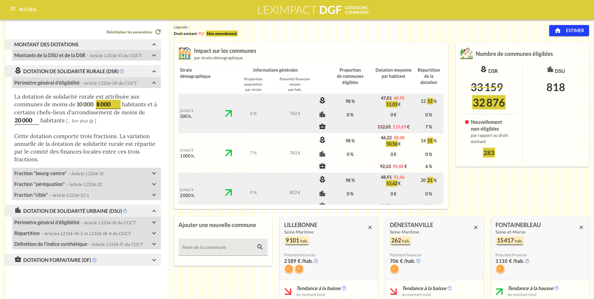

# LexImpact Client

## Introduction

LexImpact est un service de l'Assemblée nationale fournissant des outils de simulations fiscales, financières et sociales à destination des députés, administrateurs et collaborateurs. Ils sont accessibles via l'URL [https://leximpact.an.fr](https://leximpact.an.fr).

Ce dépôt contient le code du *front*. Les technologies principalement utilisées sont TypeScript, redux et React (Next.js).



## Configuration de l'environnement

| Version Node | Version npm |
| --- | --- |
| 12.x | 6.13 |

Installez les dépendances.

```
npm install
```

Exécutez les tests.

```
npm run test
```

Vérifiez le *linting* du code.

```
npm run code:check
```

Compilez et lancez l'application en développement (*watch mode*).

```
npm run dev
```

Alternativement, vous pouvez aussi compiler et lancer l'application séparément (pour une CI ou la production).

```
npm run build
npm run start
```

## Structure des fichiers

### Organisation des composants

```bash
- common # Composants communs à toutes les pages
- dotations # Composants spécifiques à la page dotations
  - common # Composants communs à plusieurs parties de la page
  - articles # Section paramètres à gauche
  - results # Resultats à droite
    - common
    - ...
- ir # Composants spécifiques à la page ir
- ... # Composants spécifiques à la page ...
```

### Organisation de l'état de l'application


```bash
- parameters # Paramètres de loi modifiables (panneau latéral de gauche)
  - amendement # Valeurs modifiées par l'utilisateur
    - ir
    - dotations
  - base # Valeurs présentes dans le code en vigueur
    - ir
    - dotations
  - plf # Valeurs proposées par le Projet de loi de finances
    - ir
    - dotations
  - interfaces # Descriptions des états (identiques dans amendement, base et plf)
    - ir
    - dotations
- results # Résultats de la simulation
  - amendement # Résultats correspondant aux valeurs modifiées par l'utilisateur
    - ir
    - dotations
  - base # Résultats correspondant aux valeurs du code en vigueur
    - ir
    - dotations
  - plf # Résultats correspondant aux valeurs proposées par le Projet de loi de finances
    - ir
    - dotations
  - baseToPlf # Résultats comparant le PLF avec le code existant
    - ir
    - dotations
  - baseToAmendement  # Résultats comparant les valeurs proposées par l'utilisateur avec le code existant
    - ir
    - dotations
  - interfaces # Descriptions des états (identiques dans amendement, base et plf)
    - ir
    - dotations
- descriptions # Autres paramètres de la simulation qui ne sont pas des paramètres de la loi.
  - ir
    - casTypes
  - dotations
    - communesTypes
- auth # Elements d'authentification
- display # Element d'affichage (l'affichage d'un message d'information est géré dans cette section)
  - ir
  - dotations
```

## Architecture d'un composant

```typescript
interface Props {

}

const mapStateToProps = (state: RootState) => ({
  // ...
});

const mapDispatchToProps = (dispatch, { /* ... */ }: Props) => ({
  // ...
});

const connector = connect(mapStateToProps, mapDispatchToProps);

type PropsFromRedux = ConnectedProps<typeof connector>;

class Foobar extends PureComponent<PropsFromRedux & Props> {
  // ...
}

const Component = connector(Foobar);

export { Component as Foobar };

```

## Configuration file `.env`

A file name `.env` is necessary for the client to work properly. The file `.env.example` can be copied into it.

Here ate the environment variables that you have to set:
- `API_URL`: leximpact-client is just a web interface that does not do computations by itself, but needs to be provided a working [leximpact-server](https://github.com/leximpact/leximpact-server/) Web API to fetch results. As of v`1.0.0`, a working API example can be found on: https://api.leximpact.an.fr
- `PORT`: describes the port that the client will be setup to (e.g. the website will be accessible from http://127.0.0.1:<PORT> if the client is run locally). If ommited, defaults to `9001`

## Snapshot testing with Jest

Snapshot tests are a very useful tool whenever you want to make sure your UI does not change unexpectedly.

> A typical snapshot test case for a mobile app renders a UI component, takes a snapshot, then compares it to a reference snapshot file stored alongside the test. The test will fail if the two snapshots do not match: either the change is unexpected, or the reference snapshot needs to be updated to the new version of the UI component.


For more information, please see the Jest [official documentation](https://jestjs.io/docs/en/snapshot-testing).

Here is the command to run these tests:

```shell
npm run test
```

To update the reference snapshots, run:

```shell
npm run test --updateSnapshots
```

This is similar to: `./node_modules/.bin/jest --updateSnapshots`

# Use with Docker

Build with:

```shell
docker build . -t leximpact-client:local
```

Run with:

```shell
docker run -v $PWD:/opt/leximpact-client leximpact-client:local
```